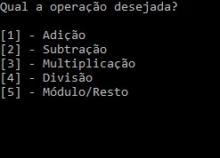
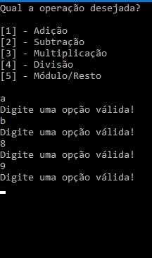
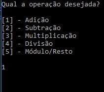
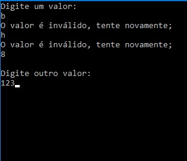
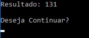
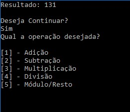
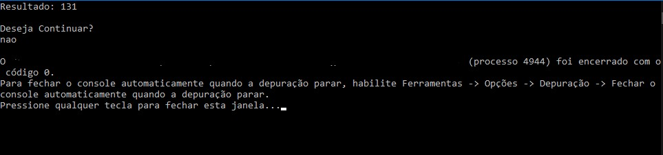

## CALCULADORA

 - Calculadora feita em C#
 - Tipo de Projeto: Console
 - Possui métodos de verificação de valores inválidos.

## OPERAÇÕES 

 - Adição
 - Subtração
 - Multiplicação
 - Divisão
 - Módulo/Resto

## TECNOLOGIA

 - C# 11
 - .NET 7.0

## SCREENSHOTS 

# PROJETO FUNCIONANDO e TRATAMENTO DE EXCEÇÕES

